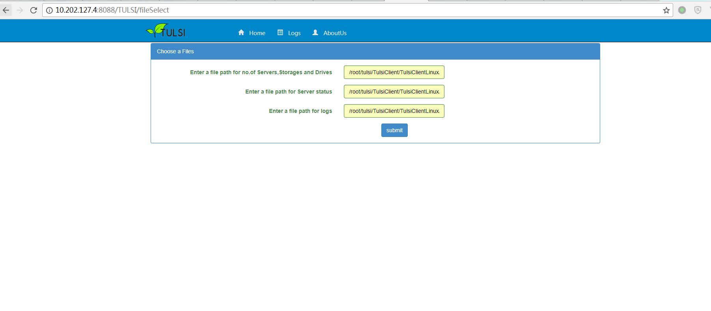
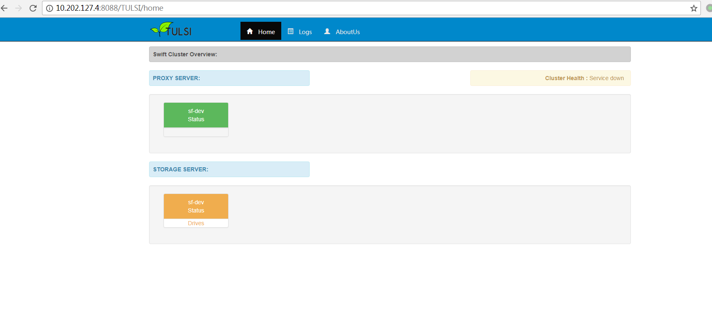
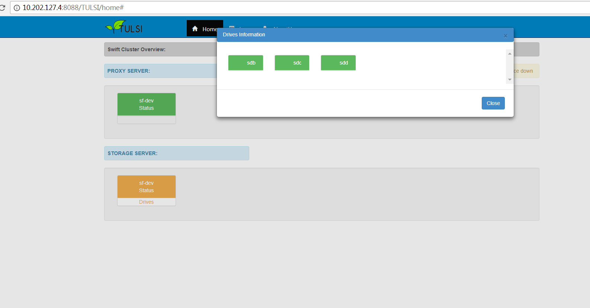
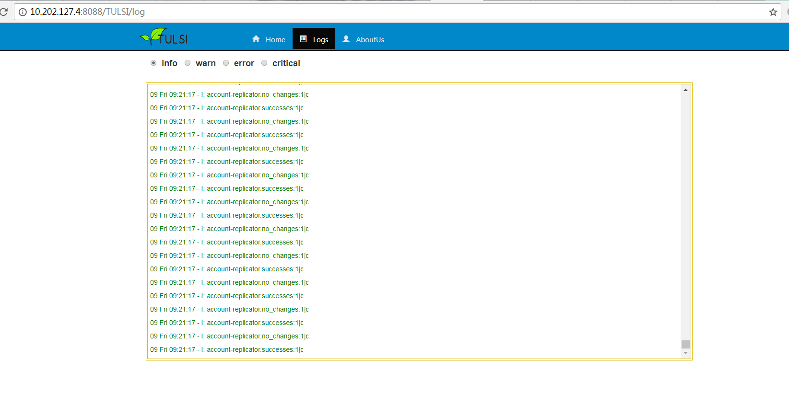

# Tulsi 部署手册 #
---

## 目录 ##

* [项目简介](#introduction)
* [项目部署](#deplyment)
	* [安装Tulsi Server](#tulsiserver)
	* [安装Tulsi Client](#tulsiclient)
	* [安装Tulsi Client UI](#tulsiclientui)
* [参考资料](#consultation)

| 日期 | 版本 | AMD | 作者 |
| :--- | :--- | :---: | :--- |
| 2018-02-10 | V1.0 | A | 01107267 |

<span id="introduction"></span>
## 项目简介

Swift项目在Openstack生态系统中提供对象存储服务。Tulsi 是由软件解决方案供应商 [Vedams](http://www.vedams.com/) 在 [GitHub](https://github.com/vedgithub/tulsi.git) 开源的一套监控 Openstack Swift 集群健康状态的的工具。 Tulsi 主要是检查集群中服务和磁盘驱动的状态。它能提供Swift集群的图形化布局，并使用适当的颜色来表示每个节点的状态。它会在StatsD度量标准之上执行并应用异常检测算法，以确定集群的健康状况。

Tulsi 功能摘要：

- 监控集群中磁盘的状态
- 监控监控集群中每个节点的各个Swift服务的状态
- 监控集群StatsD度量指标日志
- 运用异常检测算法来检查StatsD指标数据

Tulsi 项目组成：

- Tulsi Server ： 部署在集群的每一个节点，用来收集集群上每个节点的Swift服务状态
- Tulsi Client ： 部署在集群的控制节点或者是其他任意与集群能够网络连通的节点。Client由两部分组成，分别为TulsiClent和TulsiStatsdCleint。TulsiClient主要负责接收Tulsi Server 发送来的集群服务状态信息，并为图形化集群布局和状态提供后台支撑；TulsiStatsdCleint接收由Swift内置的StatsD组件收集并发送的集群每个服务的状态数据，并通过异常检测算法来确定集群的健康状况，同时以StatsD日志格式在客户端UI上展示
- Tulsi Client UI ：Tulsi Client 的可视化组件，与 Tulsi Client 部署在一起。

<a id="deplyment"></a>
## 项目部署 ##

> **提示：** 如无特别说明，本文使用的命令都是在ROOT权限下执行

因为我们的OS环境是Centos，然而Tulsi只提供了适合Ubuntu环境下的部署工具，同时GitHub上的源代码存在一些缺陷。这里提供我已经修复影响项目运行Bug后的源代码地址：

[http://10.202.16.216/cloudStorage/tulsi-sf.git](http://10.202.16.216/cloudStorage/tulsi-sf.git)

你可以使用用户 <code style="color:#e74c3c; padding:1px 3px; border: solid 1px #e1e4e5">test123</code> 克隆或者下载源代码，用户密码为 <code style="color:#e74c3c; padding:1px 3px; border: solid 1px #e1e4e5">12345678</code>

<a id="tulsiserver"></a>
### 安装Tulsi Server ###

在Swift各节点下载Tulsi安装包

	git clone http://10.202.16.216/cloudStorage/tulsi-sf.git

打开Tulsi目录

	cd tulsi-sf/TulsiServer

执行tulsi脚本

	chmod +x tulsi.sh
	sh tulsi.sh

编辑配置文件 ```/etc/tulsi/tulsi.conf ```

	...
	[tulsi]
	host = Tulsi_Clent_IP_Address
	port = 5005
	...

> **注意：** Client默认通信端口为5005，如果你要修改此端口，应该确保在Client和Server中端口一致

安装start-stop-daemon工具

	wget http://developer.axis.com/download/distribution/apps-sys-utils-start-stop-daemon-IR1_9_18-2.tar.gz
	tar zxf apps-sys-utils-start-stop-daemon-IR1_9_18-2.tar.gz
	cd apps/sys-utils/start-stop-daemon-IR1_9_18-2/
	cc start-stop-daemon.c -o start-stop-daemon

启动 tulsi server

	service tulsi start

查看服务状态

	service tulsi status

停止服务

	service tulsi stop

<a id="tulsiclient"></a>
### 安装Tulsi Client ###

开启Swift集群的logstatsd

- 编辑 ```/etc/swift/proxy-server.conf``` 文件
 	
	 	[DEFAULT]
	 	log_statsd_host = 10.202.127.4	#设置为StatsD服务节点IP如果log_statsd_host不设置则表示不开启logstatsd
	 	log_statsd_port = 8125
	 	log_statsd_default_sample_rate = 1.0
	 	log_statsd_sample_rate_factor = 1.0
	 	log_statsd_metric_prefix =
	 	...
	 	[pipeline:main]
	 	pipeline = ... proxy-logging proxy-server		#配置proxy-logging
	 	...
	 	[filter:proxy-logging]
	 	...
	 	log_statsd_host = 10.202.127.4	#设置为StatsD服务节点IP
	 	log_statsd_port = 8125
	 	log_statsd_default_sample_rate = 1.0
	 	log_statsd_sample_rate_factor = 1.0
	 	log_statsd_metric_prefix =
	 	...
	 	log_statsd_valid_http_methods = GET,HEAD,POST,PUT,DELETE,COPY,OPTIONS
	 	...
 	
- 编辑 ```/etc/swift/account-server.conf``` 文件

	 	[DEFAULT]
	 	...
	 	log_statsd_host = 10.202.127.4	#设置为StatsD服务节点IP
	 	log_statsd_port = 8125
	 	log_statsd_default_sample_rate = 1.0
	 	log_statsd_sample_rate_factor = 1.0
 		...
 
- 编辑 ```/etc/swift/container-server.conf``` 文件

	 	[DEFAULT]
	 	...
	 	log_statsd_host = 10.202.127.4	#设置为StatsD服务节点IP
	 	log_statsd_port = 8125
	 	log_statsd_default_sample_rate = 1.0
	 	log_statsd_sample_rate_factor = 1.0
		...
 
- 编辑 ```/etc/swift/object-server.conf``` 文件

	 	[DEFAULT]
	 	...
	 	log_statsd_host = 10.202.127.4	#设置为StatsD服务节点IP
	 	log_statsd_port = 8125
	 	log_statsd_default_sample_rate = 1.0
	 	log_statsd_sample_rate_factor = 1.0
		...

重启Swift如下几个服务

	systemctl restart openstack-swift-proxy.service
	systemctl restart openstack-swift-account.service openstack-swift-account-auditor.service \
	                  openstack-swift-account-reaper.service openstack-swift-account-replicator.service
	systemctl restart openstack-swift-container.service openstack-swift-container-auditor.service \
	                  openstack-swift-container-replicator.service openstack-swift-container-updater.service
	systemctl restart openstack-swift-object.service openstack-swift-object-auditor.service \
	                  openstack-swift-object-replicator.service openstack-swift-object-updater.service


安装依赖

- python 2.7
- Numpy

		pip install Numpy

- Scipy

		pip install Scipy

在部署节点新建 ```/etc/tulsi``` 目录

	mkdir /etc/tulsi

打开项目目录

	cd tulsi-sf/TulsiClient/TulsiClientLinux

拷贝配置文件到 ```/etc/tulsi``` 目录

	cp src/tulsiclient.conf /etc/tulsi/tulsi.conf

编辑配置文件 ```/etc/tulsi/tulsi.conf```

	[tulsi]
	host = <<Ip of the host>>
	port = 5005
	[tulsistatsd]
	host = << IP of the host>>
	port = 8125
	log_duration = 10

为 ```TulsiClient.sh``` 增加可执行权限

	chmod a+x TulsiClient.sh

启动 Tulsi

	sh TulsiClient.sh

>**注意：** 启动Client之前应该先启动Tulsi Server； 必须使用swift群集中的主机IP启用logstatd参数以获取statsd日志。


<a id="tulsiclientui"></a>
### 安装Tulsi Client UI ###

>**注意：** 在部署UI前应该先安装启动Tulsi Client

下载并安装Tomcat（前提是安装好JAVA环境）

	wget http://mirrors.hust.edu.cn/apache/tomcat/tomcat-7/v7.0.84/bin/apache-tomcat-7.0.84.tar.gz
	tar zxf apache-tomcat-7.0.84.tar.gz -C /usr/local
	mv apache-tomcat-7.0.84.tar.gz tomcat

打开项目目录

	cd tulsi-sf/TulsiClientUI

拷贝 ```TULSI.war``` 到 Tomcat的webapps目录

	cp TULSI.war /usr/local/tomcat/webapps/
	
启动Tomcat

	/usr/local/tomcat/bin/startup.sh

浏览器访问

	http://<<ip_of_system>>:8080/TULSI

分别在对应的表单中输入集群配置文件 ```clusterConfig.txt``` , 集群状态文件 ```clusterStatus.txt``` 和集群日志文件 ```logfile.txt``` 的路径，并提交即可。如下为我的部署环境三个文件的路径：

	/root/tulsi-sf/TulsiClient/TulsiClientLinux/src/clusterConfig.txt
	/root/tulsi-sf/TulsiClient/TulsiClientLinux/src/clusterStatus.txt
	/root/tulsi-sf/TulsiClient/TulsiClientLinux/src/log/logfile.txt


	
集群图形化布局如下：

- 节点布局，与节点服务状态



- 节点磁盘状态



- StatsD日志



<a id="consultation"></a>
## 参考资料 ##

[1] [Openstack Swift官方文档](https://docs.openstack.org/swift/latest/)<br>
[2] [Health Monitoring System for OpenStack](http://biarca.io/pages/resources/resources_pdfs/Biarca_Health_Monitoring_System_case-study.pdf)<br>
[3] [Tulsi – a Swift health monitoring tool](https://www.packtpub.com/mapt/book/virtualization_and_cloud/9781785283598/6/ch06lvl1sec40/tulsi--a-swift-health-monitoring-tool)